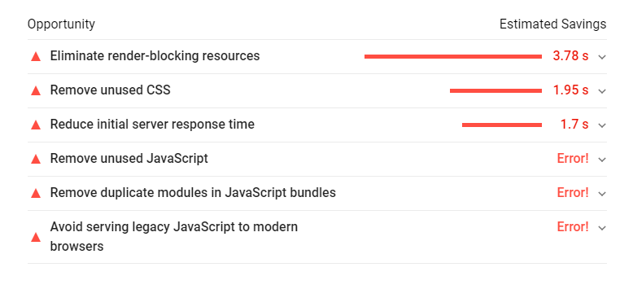

1. How long did you spend on the coding test?

<b>
I have utilized 12 hrs of time approximately
</b>

What would you add to your solution if you had more time? If you didn't spend much time on the coding test then use this as an opportunity to explain what you would add.

<!--
> Actually I am tried to host on the github but I am using my company laptop so that I was not able to host there I lost some time so after that I have tried to deploy on heroku.
-->
<b>
1 . I will add PropTypes for the components.

2 . I will add Customizable templates for Invoices for user so that User can make his own style of Invoices.

3 . I will make app more responsive and better user experience by adding more CSS

4 . Some of the features specified in the 'Take Home Challenge' Document were not implemented due to some time wasted on github hosting thing which is problem for working from the office laptop so I have hosted on heroku.

</b>

Question:

 What was the most useful feature that was added by you in the application? Did you use any existing library for it? If yes, please share the link. Please include a snippet of code that shows how you've used it.


<b> I have added Component to PDF generating feature. I have used    <b>"@progress/kendo-react-pdf": "^2.0.0"</b> package
link to npm package <a>https://www.npmjs.com/package/@progress/kendo-react-pdf</a>

InvoiceComponent.js whatever all the children rendered in <PdfContainer> component will be converted as downloadable PDF document using refs.
</b>

```
<PdfContainer
                    createPdf={this.createPdf}
                >
                    <div className="container">
                        <h2> INVOICE </h2>
                        <address>
                            <strong>Twitter, Inc.</strong><br />
                                1355 Market St, Suite 900<br />
                                San Francisco, CA 94103<br />
                            <abbr title="Phone">P:</abbr> (123) 456-7890
                            </address>
                        <table className="table table-hover w-60">
                            <thead className="thead-dark">
                                <tr>
                                    <th>Item Name </th>
                                    <th>No of Units</th>
                                    <th>Quantity</th>
                                    <th>Unit Price</th>
                                    <th>Discount</th>
                                    <th>Tax</th>
                                </tr>
                            </thead>
                            <tbody>
                                {Boolean(all_invoices.length) &&
                                    all_invoices.map((val, index) => {
                                        return (
                                            <tr key={val.id} className="trHover">
                                                <td>{val.item_name}</td>
                                                {/* <td>{val.item_description}</td> */}
                                                <td>{val.number_of_units}</td>
                                                <td>{val.quantity}</td>
                                                <td>{val.unit_price}</td>
                                                <td>{val.discount}</td>
                                                <td>{val.tax}</td>
                                                <span className="editSpan" onClick={() => this.props.onEditClick(val.id)}>
                                                    Edit
                                                </span>
                                            </tr>
                                        );
                                    })
                                }
                            </tbody>
                        </table>
                    </div>
                </PdfContainer>
```
<b>
DocService.js here where actual PDF file download happens using savePDF method from package @progress/kendo-react-pdf
</b>

```
import { savePDF } from '@progress/kendo-react-pdf';

class DocService {
  createPdf = (html) => {
      console.log("HTML >>>", html);
    savePDF(html, {
      paperSize: 'Letter',
      fileName: 'form.pdf',
      margin: 3
    })
  }
}

const Doc = new DocService();
export default Doc;

```

Question:

 How would you track down a performance issue in production? Have you ever had to do this?

<b>
Performance issues we can catch by using <b>PageSpeed Insights - Google Developers</b>

Link: <a>https://developers.google.com/speed/pagespeed/insights/</a>

Once we deploy app to production we will run our domain in the page speed insights site here it will show like what causes application slowness like below
</b>



<b>
Based on the additional information they provides we can act accordingly and improve the performance.

Yes, I have worked on the images loading optimization issue, there what I have done is, used the images next gen format to load images faster to improve the app performance.

I have wrote an article on this also, Please look into it.

<a>https://medium.com/@siluverukirankumar6/practical-guide-to-converting-and-using-webp-images-a0c71eddc05f<a>

Also I have worked on the removing of duplicated CSS classes from the project, Please check my article on that.

<a>https://medium.com/@siluverukirankumar6/remove-the-duplicated-css-classes-8e6004491ea7</a>
</b>

Question:

List of all the libraries and packages used to complete the assignement


```
"dependencies": {
    "@progress/kendo-drawing": "^1.5.7",
    "@progress/kendo-react-pdf": "^2.0.0",
    "babel-core": "^6.23.1",
    "bootstrap": "^4.3.1",
    "css-loader": "^5.0.1",
    "email-validator": "^2.0.4",
    "express": "^4.17.1",
    "lodash": "^4.17.20",
    "password-validator": "^5.1.1",
    "react": "^15.3.2",
    "react-dom": "^15.3.2",
    "react-loader": "^2.4.5",
    "react-redux": "^4.4.5",
    "react-router": "^2.8.1",
    "redux": "^3.5.2",
    "style-loader": "^2.0.0",
    "uuid-random": "^1.3.2"
  }

  "devDependencies": {
    "@babel/preset-env": "^7.12.7",
    "babel-cli": "^6.26.0",
    "babel-core": "^6.4.5",
    "babel-eslint": "^10.0.1",
    "babel-jest": "^17.0.2",
    "babel-loader": "^6.2.1",
    "babel-plugin-transform-class-properties": "^6.24.1",
    "babel-preset-env": "^1.7.0",
    "babel-preset-es2015": "^6.18.0",
    "babel-preset-react": "^6.16.0",
    "babel-preset-stage-0": "^6.5.0",
    "eslint": "^5.12.1",
    "json-loader": "^0.5.7",
    "react-hot-loader": "^1.3.0",
    "webpack": "^1.13.2",
    "webpack-dev-server": "^1.15.1"
  }

```

Note: Due some problem with my office laptop I am deployed app on heroku not on github pages

link: <a>https://invoicestatement.herokuapp.com/</a>
